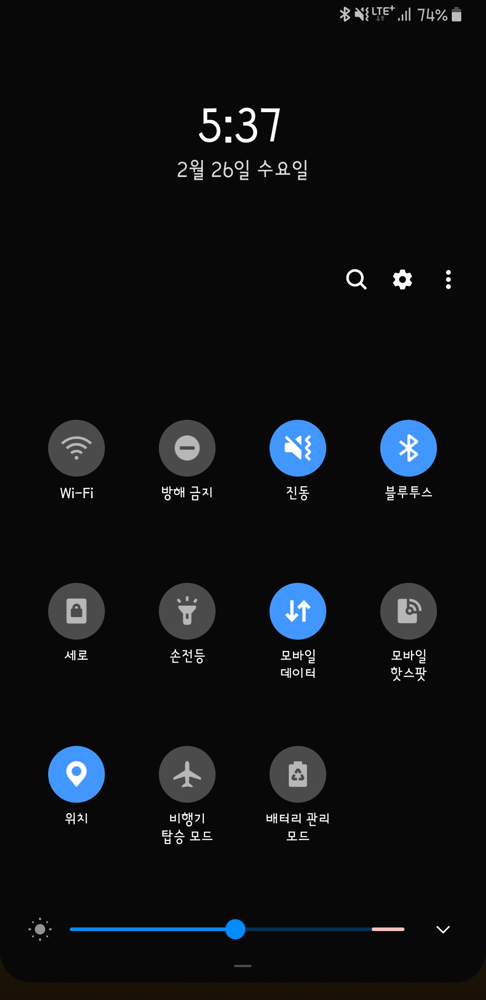
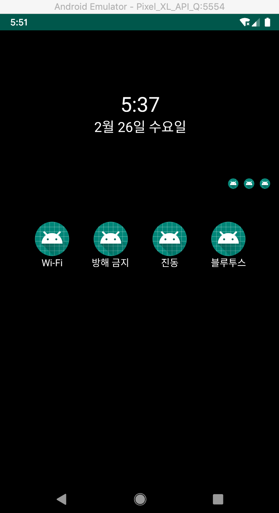

# ConstraintLayout

오늘 다뤄볼 레이아웃은 ConstraintLayout입니다.

구글에서 강력하게 추천해줬고 안드로이드 스튜디오에서 액티비티를 만들면 기본으로 설정이 될 정도로 자리잡은 레이아웃입니다.

에디터로 직접 작성하는데 익숙한 개발자인 저로써는 처음에 도대체 왜 이 레이아웃을 써야 하는지 이해를 하지 못했었는데요. 기존 RelativeLayout과 큰 차이를 못느꼇기때문입니다. 그래서 한 몇년은 무시하고있다가 그래도 이정도로 밀어주는데에는 분명한 이유가 있을거란 생각에 동영상을 검색해봤는데, 직접 작성하는 방식이 아닌 디자인 툴에서 상당히 편하게 사용 할 수 있는 레이아웃이였습니다.

장점으로는

기존 RelativeLayout과 LinearLayout의 중첩으로 인한 성능 및 가독성이 떨어지는 문제를 해결하였고
에디터툴을 사용하여 상당히 쉽게 디자인 할 수 있는점입니다.

단점으로는

기존 개발자들이 이 새로운 레이아웃에 적용하기 힘들지 않았나 싶습니다.
에디터로만 수정이 가능하기에 위젯의 아이디를 정하는데 귀찮아져 그냥 자동으로 부여되는 아이디를 사용하게 된다는 점이있습니다.





중첩없이 하나의 레이아웃에 배치한 코드입니다.
굉장히 깔끔하며 에디터로 직접수정할일이 그렇게 많지 않습니다. 실제 현업에서 일하면서 아직 사용해본적이 없어서 아마 다음기회에 사용해보지 않을까 싶습니다.

```
<?xml version="1.0" encoding="utf-8"?><!--
  ~ Copyright (c) 2020. sryang
  -->

<androidx.constraintlayout.widget.ConstraintLayout xmlns:android="http://schemas.android.com/apk/res/android"
    xmlns:app="http://schemas.android.com/apk/res-auto"
    xmlns:tools="http://schemas.android.com/tools"
    android:layout_width="match_parent"
    android:layout_height="match_parent"
    android:background="#000000"
    tools:context=".ConstraintLayoutActivity">

    <TextView
        android:id="@+id/textView2"
        android:layout_width="wrap_content"
        android:layout_height="wrap_content"
        android:text="5:37"
        android:textColor="@android:color/white"
        android:textSize="30sp"
        app:layout_constraintBottom_toBottomOf="parent"
        app:layout_constraintEnd_toEndOf="parent"
        app:layout_constraintLeft_toLeftOf="parent"
        app:layout_constraintRight_toRightOf="parent"
        app:layout_constraintStart_toStartOf="parent"
        app:layout_constraintTop_toTopOf="parent"
        app:layout_constraintVertical_bias="0.14" />

    <TextView
        android:id="@+id/textView"
        android:layout_width="wrap_content"
        android:layout_height="wrap_content"
        android:text="2월 26일 수요일"
        android:textColor="@android:color/white"
        android:textSize="20sp"
        app:layout_constraintEnd_toEndOf="@+id/textView2"
        app:layout_constraintStart_toStartOf="@+id/textView2"
        app:layout_constraintTop_toBottomOf="@+id/textView2" />

    <ImageView
        android:id="@+id/imageView"
        android:layout_width="15dp"
        android:layout_height="15dp"
        android:layout_marginEnd="8dp"
        android:src="@mipmap/ic_launcher"
        app:layout_constraintEnd_toStartOf="@+id/imageView1"
        app:layout_constraintTop_toTopOf="@+id/imageView1"
        tools:srcCompat="@tools:sample/avatars" />

    <ImageView
        android:id="@+id/imageView1"
        android:layout_width="15dp"
        android:layout_height="15dp"
        android:layout_marginEnd="8dp"
        android:src="@mipmap/ic_launcher"
        app:layout_constraintEnd_toStartOf="@+id/imageView2"
        app:layout_constraintTop_toTopOf="@+id/imageView2"
        tools:srcCompat="@tools:sample/avatars" />

    <ImageView
        android:id="@+id/imageView2"
        android:layout_width="15dp"
        android:layout_height="15dp"
        android:layout_marginEnd="16dp"
        android:src="@mipmap/ic_launcher"
        app:layout_constraintBottom_toBottomOf="parent"
        app:layout_constraintEnd_toEndOf="parent"
        app:layout_constraintTop_toTopOf="parent"
        app:layout_constraintVertical_bias="0.335"
        tools:srcCompat="@tools:sample/avatars" />

    <ImageView
        android:id="@+id/imageView3"
        android:layout_width="50dp"
        android:layout_height="50dp"
        android:layout_marginStart="16dp"
        android:layout_marginTop="48dp"
        android:src="@mipmap/ic_launcher"
        app:layout_constraintEnd_toStartOf="@+id/imageView4"
        app:layout_constraintHorizontal_bias="0.5"
        app:layout_constraintStart_toStartOf="parent"
        app:layout_constraintTop_toBottomOf="@+id/imageView"
        tools:srcCompat="@tools:sample/avatars" />

    <ImageView
        android:id="@+id/imageView4"
        android:layout_width="50dp"
        android:layout_height="50dp"
        android:src="@mipmap/ic_launcher"
        app:layout_constraintEnd_toStartOf="@+id/imageView5"
        app:layout_constraintHorizontal_bias="0.5"
        app:layout_constraintStart_toEndOf="@+id/imageView3"
        app:layout_constraintTop_toTopOf="@+id/imageView3"
        tools:srcCompat="@tools:sample/avatars" />

    <ImageView
        android:id="@+id/imageView5"
        android:layout_width="50dp"
        android:layout_height="50dp"
        android:src="@mipmap/ic_launcher"
        app:layout_constraintEnd_toStartOf="@+id/imageView6"
        app:layout_constraintHorizontal_bias="0.5"
        app:layout_constraintStart_toEndOf="@+id/imageView4"
        app:layout_constraintTop_toTopOf="@+id/imageView4"
        tools:srcCompat="@tools:sample/avatars" />

    <ImageView
        android:id="@+id/imageView6"
        android:layout_width="50dp"
        android:layout_height="50dp"
        android:layout_marginEnd="16dp"
        android:src="@mipmap/ic_launcher"
        app:layout_constraintEnd_toEndOf="parent"
        app:layout_constraintHorizontal_bias="0.5"
        app:layout_constraintStart_toEndOf="@+id/imageView5"
        app:layout_constraintTop_toTopOf="@+id/imageView5"
        tools:srcCompat="@tools:sample/avatars" />

    <TextView
        android:id="@+id/textView3"
        android:layout_width="wrap_content"
        android:layout_height="wrap_content"
        android:text="Wi-Fi"
        android:textColor="@android:color/white"
        app:layout_constraintEnd_toEndOf="@+id/imageView3"
        app:layout_constraintStart_toStartOf="@+id/imageView3"
        app:layout_constraintTop_toBottomOf="@+id/imageView3" />

    <TextView
        android:id="@+id/textView4"
        android:layout_width="56dp"
        android:layout_height="16dp"
        android:text="방해 금지"
        android:textColor="@android:color/white"
        app:layout_constraintEnd_toEndOf="@+id/imageView4"
        app:layout_constraintStart_toStartOf="@+id/imageView4"
        app:layout_constraintTop_toBottomOf="@+id/imageView4" />

    <TextView
        android:id="@+id/textView5"
        android:layout_width="wrap_content"
        android:layout_height="wrap_content"
        android:text="진동"
        android:textColor="@android:color/white"
        app:layout_constraintEnd_toEndOf="@+id/imageView5"
        app:layout_constraintStart_toStartOf="@+id/imageView5"
        app:layout_constraintTop_toBottomOf="@+id/imageView5" />

    <TextView
        android:id="@+id/textView6"
        android:layout_width="wrap_content"
        android:layout_height="wrap_content"
        android:text="블루투스"
        android:textColor="@android:color/white"
        app:layout_constraintEnd_toEndOf="@+id/imageView6"
        app:layout_constraintStart_toStartOf="@+id/imageView6"
        app:layout_constraintTop_toBottomOf="@+id/imageView6" />


</androidx.constraintlayout.widget.ConstraintLayout>
```

동영상 수정하여 올리기