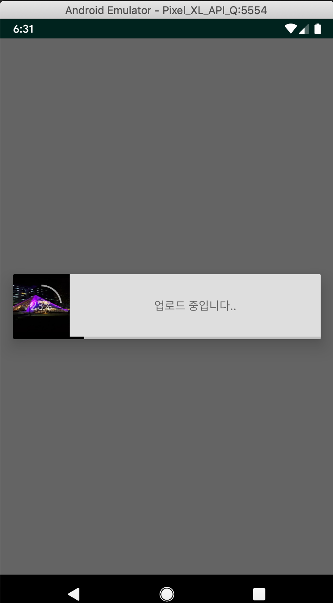

# 파일 선택 다이얼로그 만들기



다이얼로그는 화면크기를 xml에서 wrap_contents나 match_parent로 설정하려면 다이얼로그
생성 시 아래 코드를 넣어줘야합니다. 이거도 양끝에 약간에 마진이 남으므로 화면에 꽉차는 디이얼
로그를 만들고 싶다면 아마 조금 검색을 할 것 같습니다.
```
WindowManager.LayoutParams lp = new WindowManager.LayoutParams();
        lp.copyFrom(getWindow().getAttributes());
        lp.width = WindowManager.LayoutParams.MATCH_PARENT;
        lp.height = WindowManager.LayoutParams.WRAP_CONTENT;
        getWindow().setAttributes(lp);
```