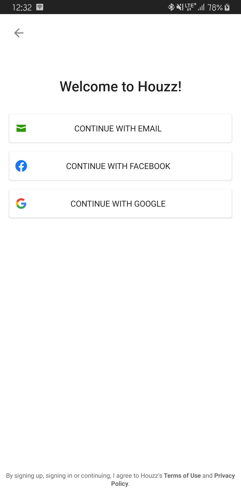
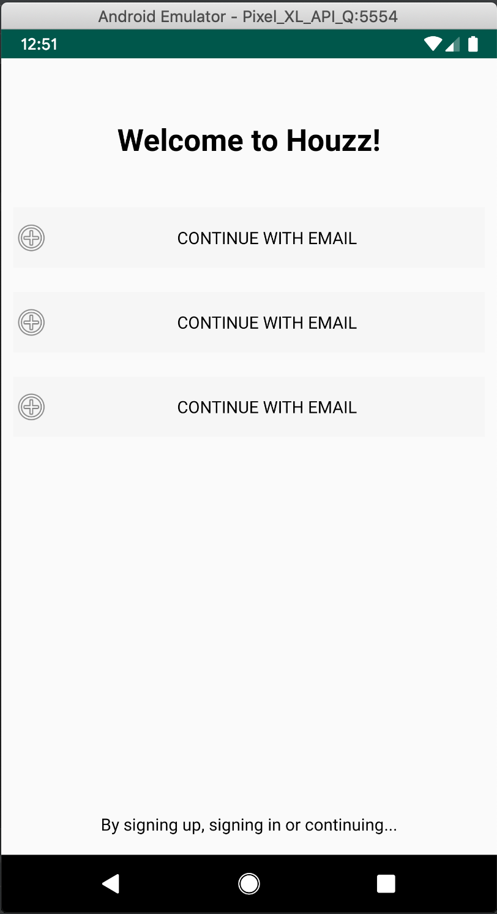

# LinearLayout
안드로이드를 첫 빌드를 하고 내가 만들고 싶은 화면을 만들려고 시작할 때 가장 먼저 접하는
레이아웃 중에 하나입니다.

장점과 주요 기능으로는
사용하기가 쉽습니다.
순차적으로 위젯들을 가로 또는 세로로 배치할 수 있고
weight를 사용하여 화면의 비율을 이용 할 수 있습니다.

단점으로는 
복잡한 화면을 만들 경우
레이아웃을 여러번 중첩해야하는 상황이 생기는데 가독성이나
성능에 있어서 안좋을것으로 알고 있습니다.

LinearLayout를 사용하여 화면을 만들어보도록 하겠습니다.

아래 화면은 Houzz라는 어플리케이션의 로그인 화면입니다.



LinearLayout을 활용하여 만든 화면입니다.



```xml
<?xml version="1.0" encoding="utf-8"?><!--
  ~ Copyright (c) 2020. sryang
  -->

xml 소스코드 입니다.
<LinearLayout xmlns:android="http://schemas.android.com/apk/res/android"
    xmlns:tools="http://schemas.android.com/tools"
    android:layout_width="match_parent"
    android:layout_height="match_parent"
    android:orientation="vertical"
    tools:context=".LinearLayoutActivity">

    <TextView
        android:layout_width="wrap_content"
        android:layout_height="wrap_content"
        android:layout_gravity="center_horizontal"
        android:layout_marginTop="50dp"
        android:layout_marginBottom="30dp"
        android:text="Welcome to Houzz!"
        android:textColor="@android:color/black"
        android:textSize="25sp"
        android:textStyle="bold" />


    <!--  Email  -->
    <LinearLayout
        android:layout_width="match_parent"
        android:layout_height="50dp"
        android:layout_margin="10dp"
        android:background="#55EEEEEE"
        android:orientation="horizontal">

        <ImageView
            android:layout_width="30dp"
            android:layout_height="30dp"
            android:layout_gravity="center_vertical"
            android:src="@android:drawable/ic_menu_add" />

        <LinearLayout
            android:layout_width="match_parent"
            android:layout_height="wrap_content"
            android:layout_gravity="center_vertical"
            android:orientation="vertical">

            <TextView
                android:layout_width="wrap_content"
                android:layout_height="wrap_content"
                android:layout_gravity="center_horizontal"
                android:text="CONTINUE WITH EMAIL"
                android:textColor="@android:color/black" />
        </LinearLayout>

    </LinearLayout>

    <!--  FaceBook  -->

    <LinearLayout
        android:layout_width="match_parent"
        android:layout_height="50dp"
        android:layout_margin="10dp"
        android:background="#55EEEEEE"
        android:orientation="horizontal">

        <ImageView
            android:layout_width="30dp"
            android:layout_height="30dp"
            android:layout_gravity="center_vertical"
            android:src="@android:drawable/ic_menu_add" />

        <LinearLayout
            android:layout_width="match_parent"
            android:layout_height="wrap_content"
            android:layout_gravity="center_vertical"
            android:orientation="vertical">

            <TextView
                android:layout_width="wrap_content"
                android:layout_height="wrap_content"
                android:layout_gravity="center_horizontal"
                android:text="CONTINUE WITH EMAIL"
                android:textColor="@android:color/black" />
        </LinearLayout>

    </LinearLayout>

    <!--  Google  -->

    <LinearLayout
        android:layout_width="match_parent"
        android:layout_height="50dp"
        android:layout_margin="10dp"
        android:background="#55EEEEEE"
        android:orientation="horizontal">

        <ImageView
            android:layout_width="30dp"
            android:layout_height="30dp"
            android:layout_gravity="center_vertical"
            android:src="@android:drawable/ic_menu_add" />

        <LinearLayout
            android:layout_width="match_parent"
            android:layout_height="wrap_content"
            android:layout_gravity="center_vertical"
            android:orientation="vertical">

            <TextView
                android:layout_width="wrap_content"
                android:layout_height="wrap_content"
                android:layout_gravity="center_horizontal"
                android:text="CONTINUE WITH EMAIL"
                android:textColor="@android:color/black" />
        </LinearLayout>

    </LinearLayout>

    <!--  bottom information  -->
    <LinearLayout
        android:layout_width="match_parent"
        android:layout_height="match_parent">

        <TextView
            android:layout_width="match_parent"
            android:layout_height="wrap_content"
            android:layout_gravity="bottom"
            android:layout_marginBottom="8dp"
            android:gravity="center_horizontal"
            android:text="By signing up, signing in or continuing..."
            android:textColor="@android:color/black" />
    </LinearLayout>


</LinearLayout>
```

개발하는 과정을 영상으로 기록했는데 화면을 개발하는 도중에 이상한 부분들이 있는데 이부분은 영상과 함께 편집해서 다시 올리도록하겠습니다.

읽어주셔서 감사합니다 :)