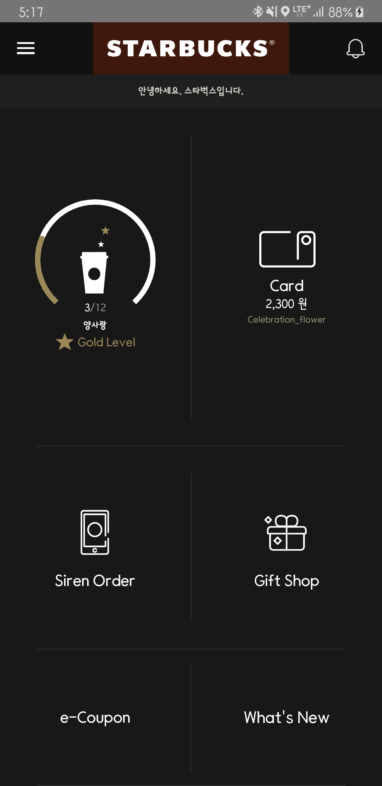
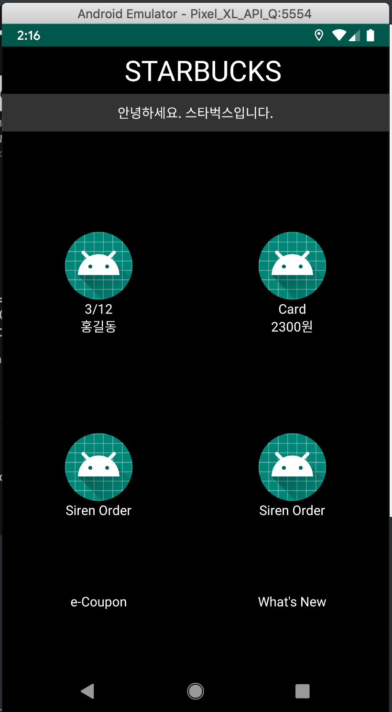

# RelativeLayout

오늘은 RelativeLayout에 대해서 알아보려고 합니다. LinearLayout과 함께 제가 가장 많이 사용하는 레이아웃중 하나인데요, ConstraintLayout이 생기면서 이 두 레이아웃은 이제 거이 사용하지 않고 있습니다. 그래도 실제 현업에서 ConstraintLayout을 사용해본적은 없어서 막상 실제로 프로젝트를 하게되면 위 두레이아웃을 주로 사용하지 않을까 싶습니다.

RelativeLayout의 장점으로는

LinearLayout에서 구현할 수 없는 레이아웃을 겹처서 배치 할 수 있고,부모 레이아웃의 상하좌우 중앙에 배치한다던지 어떠한 위젯을 기준으로 오른쪽 왼쪽 아래 위 등 위젯을 자유롭게 배치 할 수 있습니다.

단점으로는 LinearLayout과 마찬가지로 중첩이 많이 필요한 경우가 생길 수 가 있어 코드 가독성이 떨어지고 성능면에도 안좋은 것으로 알 고 있습니다.






레이아웃만 200라인이 넘는 코드가 만들어졌습니다. 많은 중첩과 가독성이 떨어지는 걸 볼 수 있습니다.

```
<?xml version="1.0" encoding="utf-8"?><!--
  ~ Copyright (c) 2020. sryang
  -->

<RelativeLayout xmlns:android="http://schemas.android.com/apk/res/android"
    xmlns:app="http://schemas.android.com/apk/res-auto"
    xmlns:tools="http://schemas.android.com/tools"
    android:layout_width="match_parent"
    android:layout_height="match_parent"
    android:background="@android:color/black"
    tools:context=".MainActivity">

    <androidx.appcompat.widget.Toolbar
        android:id="@+id/toolbar"
        android:layout_width="match_parent"
        android:layout_height="50dp">

        <!--   LOGO   -->
        <RelativeLayout
            android:layout_width="match_parent"
            android:layout_height="match_parent">

            <TextView
                android:layout_width="wrap_content"
                android:layout_height="wrap_content"
                android:layout_centerInParent="true"
                android:text="STARBUCKS"
                android:textColor="@android:color/white"
                android:textSize="30sp" />
        </RelativeLayout>
    </androidx.appcompat.widget.Toolbar>

    <TextView
        android:id="@+id/tv_greet"
        android:layout_width="match_parent"
        android:layout_height="40dp"
        android:layout_below="@+id/toolbar"
        android:background="#333333"
        android:gravity="center"
        android:text="안녕하세요. 스타벅스입니다."
        android:textColor="@android:color/white" />

    <RelativeLayout
        android:layout_width="match_parent"
        android:layout_height="match_parent"
        android:layout_below="@+id/tv_greet">

        <TextView
            android:id="@+id/center_guide"
            android:layout_width="wrap_content"
            android:layout_height="wrap_content"
            android:layout_centerInParent="true" />

        <!--    Left    -->
        <RelativeLayout
            android:layout_width="match_parent"
            android:layout_height="match_parent"
            android:layout_toLeftOf="@id/center_guide">

            <TextView
                android:id="@+id/center_guide1"
                android:layout_width="0dp"
                android:layout_height="0dp"
                android:layout_centerInParent="true" />

            <!--     UP       -->
            <RelativeLayout
                android:layout_width="match_parent"
                android:layout_height="match_parent"
                android:layout_above="@id/center_guide1">

                <ImageView
                    android:id="@+id/iv_coffee"
                    android:layout_width="wrap_content"
                    android:layout_height="wrap_content"
                    android:layout_centerInParent="true"
                    android:src="@mipmap/ic_launcher" />

                <TextView
                    android:id="@+id/tv_count"
                    android:layout_width="wrap_content"
                    android:layout_height="wrap_content"
                    android:layout_below="@+id/iv_coffee"
                    android:layout_centerHorizontal="true"
                    android:text="3/12"
                    android:textColor="@android:color/white" />

                <TextView
                    android:id="@+id/tv_name"
                    android:layout_width="wrap_content"
                    android:layout_height="wrap_content"
                    android:layout_below="@id/tv_count"
                    android:layout_centerHorizontal="true"
                    android:text="홍길동"
                    android:textColor="@android:color/white" />

            </RelativeLayout>

            <!--     DOWN       -->
            <RelativeLayout
                android:layout_width="match_parent"
                android:layout_height="match_parent"
                android:layout_below="@id/center_guide1">


                <TextView
                    android:id="@+id/center_guide4"
                    android:layout_width="0dp"
                    android:layout_height="0dp"
                    android:layout_centerInParent="true" />

                <RelativeLayout
                    android:layout_width="match_parent"
                    android:layout_height="match_parent"
                    android:layout_above="@id/center_guide4">

                    <ImageView
                        android:id="@+id/iv_siren"
                        android:layout_width="wrap_content"
                        android:layout_height="wrap_content"
                        android:layout_centerInParent="true"
                        android:src="@mipmap/ic_launcher" />

                    <TextView
                        android:layout_width="wrap_content"
                        android:layout_height="wrap_content"
                        android:layout_below="@id/iv_siren"
                        android:layout_centerHorizontal="true"
                        android:text="Siren Order"
                        android:textColor="@android:color/white" />

                </RelativeLayout>

                <RelativeLayout
                    android:layout_width="match_parent"
                    android:layout_height="match_parent"
                    android:layout_below="@id/center_guide4">

                    <TextView
                        android:layout_width="wrap_content"
                        android:layout_height="wrap_content"
                        android:layout_centerInParent="true"
                        android:text="e-Coupon"
                        android:textColor="@android:color/white" />

                </RelativeLayout>


            </RelativeLayout>

        </RelativeLayout>

        <!--    Right    -->
        <RelativeLayout
            android:layout_width="match_parent"
            android:layout_height="match_parent"
            android:layout_toRightOf="@id/center_guide">


            <TextView
                android:id="@+id/center_guide2"
                android:layout_width="0dp"
                android:layout_height="0dp"
                android:layout_centerInParent="true" />

            <!--     UP     -->
            <RelativeLayout
                android:layout_width="match_parent"
                android:layout_height="match_parent"
                android:layout_above="@id/center_guide2">

                <ImageView
                    android:id="@+id/iv_card"
                    android:layout_width="wrap_content"
                    android:layout_height="wrap_content"
                    android:layout_centerInParent="true"
                    android:src="@mipmap/ic_launcher" />

                <TextView
                    android:id="@+id/tv_balance"
                    android:layout_width="wrap_content"
                    android:layout_height="wrap_content"
                    android:layout_below="@+id/iv_card"
                    android:layout_centerHorizontal="true"
                    android:text="Card"
                    android:textColor="@android:color/white" />

                <TextView
                    android:layout_width="wrap_content"
                    android:layout_height="wrap_content"
                    android:layout_below="@id/tv_balance"
                    android:layout_centerHorizontal="true"
                    android:text="2300원"
                    android:textColor="@android:color/white" />


            </RelativeLayout>

            <!--    Down    -->
            <RelativeLayout
                android:layout_width="match_parent"
                android:layout_height="match_parent"
                android:layout_below="@id/center_guide2">

                <TextView
                    android:id="@+id/center_guide3"
                    android:layout_width="0dp"
                    android:layout_height="0dp"
                    android:layout_centerInParent="true" />

                <RelativeLayout
                    android:layout_width="match_parent"
                    android:layout_height="match_parent"
                    android:layout_above="@id/center_guide3">


                    <ImageView
                        android:id="@+id/iv_gift"
                        android:layout_width="wrap_content"
                        android:layout_height="wrap_content"
                        android:layout_centerInParent="true"
                        android:src="@mipmap/ic_launcher" />

                    <TextView
                        android:layout_width="wrap_content"
                        android:layout_height="wrap_content"
                        android:layout_below="@id/iv_gift"
                        android:layout_centerHorizontal="true"
                        android:text="Siren Order"
                        android:textColor="@android:color/white" />


                </RelativeLayout>

                <RelativeLayout
                    android:layout_width="match_parent"
                    android:layout_height="match_parent"
                    android:layout_below="@id/center_guide3">

                    <TextView
                        android:layout_width="wrap_content"
                        android:layout_height="wrap_content"
                        android:layout_centerInParent="true"
                        android:text="What's New"
                        android:textColor="@android:color/white" />
                </RelativeLayout>

            </RelativeLayout>

        </RelativeLayout>


    </RelativeLayout>

</RelativeLayout>
```

제작 영상 수정하여 첨부하기