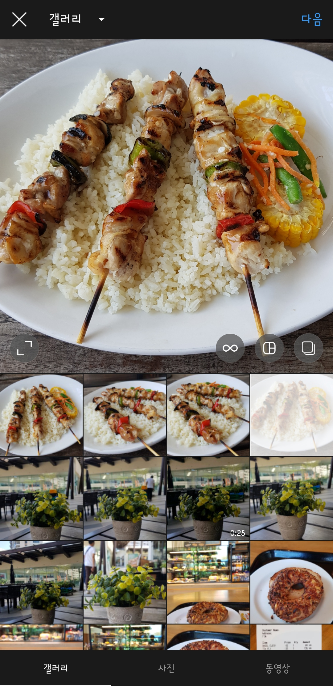
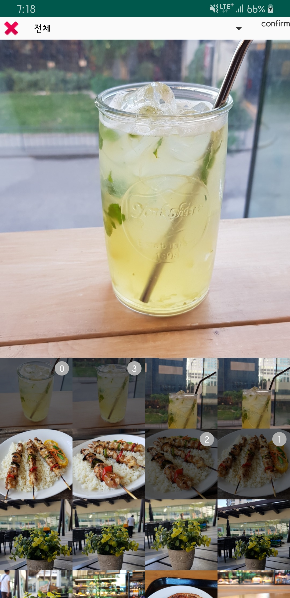

# 갤러리 이미지 선택 화면 만들기

개발중인 앱에 이미지 선택 기능이 필요해서 모듈로 만들봤습니다.

intent로 가져오게 만들면 편하지만, 새로나온 구글앱에서 선택 시 데이터가  널로 반환되는 현상, 속도도 좀 느리고, 여러 앱들중에 선택해야하는 등 여러가지 제약때문에 그냥 자체적으로 만드는게 나을 것 같아 만들어봤습니다. 안드로이드 내부 데이터를 관리하는 content resolver만 조금 공부한다면, 만들 수 있는 것 같습니다.

